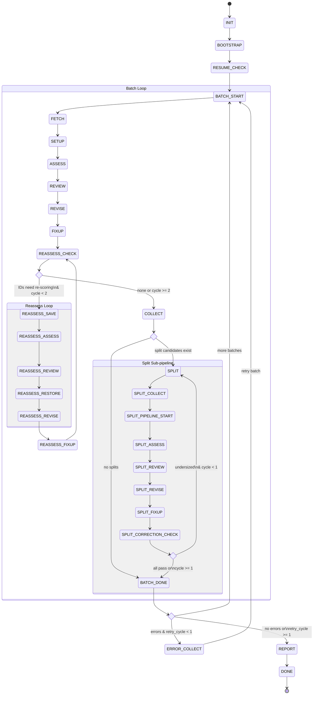

# Plan A — State Transition Diagram

```mermaid
stateDiagram-v2
    direction TB

    [*] --> INIT
    INIT --> BOOTSTRAP
    BOOTSTRAP --> RESUME_CHECK

    state "Batch Loop" as batch_loop {
        BATCH_START --> FETCH
        FETCH --> SETUP
        SETUP --> ASSESS
        ASSESS --> REVIEW
        REVIEW --> REVISE
        REVISE --> FIXUP

        FIXUP --> REASSESS_CHECK

        state reassess_decision <<choice>>
        REASSESS_CHECK --> reassess_decision
        reassess_decision --> REASSESS_SAVE : IDs need re-scoring\n& cycle < 2
        reassess_decision --> COLLECT : none or cycle >= 2

        state "Reassess Loop" as reassess {
            REASSESS_SAVE --> REASSESS_ASSESS
            REASSESS_ASSESS --> REASSESS_REVIEW
            REASSESS_REVIEW --> REASSESS_RESTORE
            REASSESS_RESTORE --> REASSESS_REVISE
            REASSESS_REVISE --> REASSESS_FIXUP
        }
        REASSESS_FIXUP --> REASSESS_CHECK

        state collect_decision <<choice>>
        COLLECT --> collect_decision
        collect_decision --> SPLIT : split candidates exist
        collect_decision --> BATCH_DONE : no splits

        state "Split Sub-pipeline" as split_pipeline {
            SPLIT --> SPLIT_COLLECT
            SPLIT_COLLECT --> SPLIT_PIPELINE_START
            SPLIT_PIPELINE_START --> SPLIT_ASSESS
            SPLIT_ASSESS --> SPLIT_REVIEW
            SPLIT_REVIEW --> SPLIT_REVISE
            SPLIT_REVISE --> SPLIT_FIXUP
            SPLIT_FIXUP --> SPLIT_CORRECTION_CHECK

            state correction_decision <<choice>>
            SPLIT_CORRECTION_CHECK --> correction_decision
            correction_decision --> SPLIT : undersized\n& cycle < 1
            correction_decision --> BATCH_DONE : all pass or\ncycle >= 1
        }
    }

    RESUME_CHECK --> BATCH_START

    state batch_decision <<choice>>
    BATCH_DONE --> batch_decision
    batch_decision --> BATCH_START : more batches
    batch_decision --> ERROR_COLLECT : errors & retry_cycle < 1
    batch_decision --> REPORT : no errors or\nretry_cycle >= 1

    ERROR_COLLECT --> BATCH_START : retry batch

    REPORT --> DONE
    DONE --> [*]
```
