# Unified State Machine

Correctness reference for the RFE Creator pipeline. Every state, transition, and
invariant documented here must be preserved through refactoring. Code location
references point to current source; verify against live code before acting.

---

## 1. Complete State Enum

### 1.1 Task Status (rfe-task frontmatter `status`)

| State | Description | Code Location |
|---|---|---|
| `Draft` | Newly created, not yet reviewed or submitted | `artifact_utils.py:50-54` |
| `Ready` | Fetched from Jira, available for processing | `fetch_issue.py` |
| `Submitted` | Successfully pushed to Jira (new or updated) | `submit.py`, `split_submit.py` |
| `Archived` | Parent archived after split decomposition; excluded from regular submit | `split-agent.md` Step 3 |

Note: `Draft` and `Ready` are functionally equivalent for submission -- `submit.py`
does not gate on either; it filters by exclusion (not Archived, not Submitted)
rather than requiring a specific status.

### 1.2 Review Recommendation (rfe-review frontmatter `recommendation`)

| State | Description | Code Location |
|---|---|---|
| `submit` | RFE passes rubric (score >= 7, no zeros) | `review-agent.md` Step 4 |
| `revise` | Below threshold but improvable; also used as initial/error default | `review-agent.md` Step 4 |
| `split` | Right-sized scored 0 (or 1 with independent segments), no other criterion at 0 | `review-agent.md` Step 4 |
| `reject` | Fundamentally infeasible or needs rethinking | `review-agent.md` Step 4 |
| `autorevise_reject` | Score regressed after auto-revision (score < before_score); terminal | `filter_for_revision.py:49-55` |

### 1.3 Review Composite Fields

| Field | Values | Description | Code Location |
|---|---|---|---|
| `pass` | `true` / `false` | Score >= 7 with no zero subscores | `artifact_utils.py:95` |
| `score` | 0-10 | Aggregate rubric score | `artifact_utils.py:93` |
| `before_score` | 0-10 | Score before revision (set on first pass, preserved across reassess) | `artifact_utils.py:97` |
| `auto_revised` | `true` / `false` | Content was modified by the revise agent (corrected by check_revised.py) | `artifact_utils.py:99` |
| `needs_attention` | `true` / `false` | Human escalation flag; set by review agent, revise agent, or pipeline infrastructure | `artifact_utils.py:119` |
| `needs_attention_reason` | `null` / string | Concise explanation of why needs_attention is true | `artifact_utils.py:122-126` |
| `error` | `null` / string | Machine-readable failure category | `artifact_utils.py:116` |
| `feasibility` | `feasible` / `infeasible` / `indeterminate` | Architecture feasibility assessment | `artifact_utils.py:89` |
| `scores` | dict: `{what, why, open_to_how, not_a_task, right_sized}` (each 0-2) | Per-criterion rubric scores; drives recommendation logic | `artifact_utils.py:101-111` |
| `before_scores` | `null` / dict (same shape as `scores`) | Per-criterion scores before revision (preserved across reassess) | `artifact_utils.py:127-138` |
| `revision_history` | (body-level) | NOT a frontmatter field. A `## Revision History` markdown section in the review file body. Written by revise agent (Step 5), extracted/restored by `preserve_review_state.py:31-55` via regex. Restored by prepend (accumulates across cycles). Cannot be set via `frontmatter.py` (would cause schema ValidationError). | `preserve_review_state.py:31-55` |

Note: `auto_revised` and `needs_attention` default to `false` via `apply_defaults()` on every
read/write. Score ranges (0-10, 0-2) are agent-enforced conventions, not schema-validated constraints.

### 1.3a Task Composite Fields

| Field | Type | Required | Constraints | Default | Code Location |
|---|---|---|---|---|---|
| `rfe_id` | string | yes | pattern: `^(RFE-\d+\|RHAIRFE-\d+)$` | — | `artifact_utils.py:29-33` |
| `title` | string | yes | — | — | `artifact_utils.py:34-36` |
| `priority` | string | yes | enum: Blocker/Critical/Major/Normal/Minor/Undefined | — | `artifact_utils.py:37-43` |
| `status` | string | yes | enum: Draft/Ready/Submitted/Archived | — | `artifact_utils.py:44-49` |
| `size` | string | no | enum: S/M/L/XL | null | `artifact_utils.py:50-54` |
| `parent_key` | string | no | pattern: same as `rfe_id` | null | `artifact_utils.py:55-60` |
| `original_labels` | list | no | — | null (NOT `[]`) | `artifact_utils.py:61-65`, `fetch_issue.py:80` |

Note: `original_labels` is `null` (not empty list) when a Jira issue has no labels.
This affects the L5 label-removal guard (`label in original_labels`). `priority`
defaults differ by entry path: `fetch_issue.py:77-78` defaults to `"Major"` when
the Jira issue has no priority; `/rfe.create` defaults to `"Normal"` for new RFEs.
`parent_key`
links split children to parents; used by `collect_children.py`, `submit.py` Phase 2
exclusion, and split parent detection. The `rfe_id` pattern constraint causes
`scan_task_files()` to silently skip files with non-matching IDs.

### 1.4 Error Field Values

| Value | Set By | Code Location |
|---|---|---|
| `null` (default) | Schema default / retry clearing | `artifact_utils.py:116` |
| `"fetch_failed: task file not created"` | Review Step 1 | `rfe.review/SKILL.md` Step 1 |
| `"assess_failed"` | Review Step 2 | `rfe.review/SKILL.md` Step 2 |
| `"feasibility_failed"` | Review Step 2 | `rfe.review/SKILL.md` Step 2 |
| `"review_failed"` | Review Step 3 | `rfe.review/SKILL.md` Step 3 |
| `"split_failed: agent did not write split-status file"` | Split Step 1 | `rfe.split/SKILL.md` Step 1 |
| `"split_refused: too many leaf children"` | Submit Phase 1 | `submit.py:199` |
| `"split_refused: jira conflict"` | Submit Phase 1 | `submit.py:233` |
| `"submit_failed: {msg}"` | Submit Phase 2 (also sets needs_attention=true) | `submit.py:597-605` |

### 1.5 Review Orchestration Phases (rfe.review pipeline)

| Phase | Description | Code Location |
|---|---|---|
| `PARSE` | Parse arguments, persist config to `tmp/review-config.yaml` | `rfe.review/SKILL.md` Step 0 |
| `FETCH` | Launch fetch agents for remote IDs; write task/original/comments files | Step 1 |
| `BOOTSTRAP` | Bootstrap assess-rfe plugin + fetch architecture context | Step 1.5 |
| `ASSESS` | Launch assess + feasibility agents in parallel | Step 2 |
| `REVIEW` | Launch review agents (first pass: FIRST_PASS=true) | Step 3 |
| `FILTER_REVISE` | Run `filter_for_revision.py` to determine revision needs (see 1.17) | Step 3.5 |
| `REVISE` | Launch revise agents for failing IDs | Step 3.5 |
| `CHECK_REVISED` | Run `check_revised.py` to fix `auto_revised` flag | Step 3.5 |
| `COLLECT_REASSESS` | Run `collect_recommendations.py --reassess` (see 1.16) | Step 4 |
| `REASSESS` | Preserve state, re-assess, re-review (max 2 cycles) | Step 4 |
| `FINALIZE` | Rebuild index; headless -> return to caller; interactive -> summary | Step 5 |

### 1.6 Auto-Fix Orchestration Phases (rfe.auto-fix pipeline)

| Phase | Description | Code Location |
|---|---|---|
| `AF_PARSE` | Parse mode (JQL vs explicit IDs), persist config | `rfe.auto-fix/SKILL.md` Step 0 |
| `AF_SNAPSHOT` | Run `snapshot_fetch.py` (JQL mode only) | Step 0 |
| `AF_BOOTSTRAP` | Bootstrap assess-rfe (with 1 retry on failure) | Step 1 |
| `AF_RESUME` | Run `check_resume.py` to filter already-processed IDs (see 1.20) | Step 2 |
| `AF_BATCH_LOOP` | Per-batch: review -> collect (see 1.16) -> split (if needed) -> summary | Steps 3a-3d |
| `AF_RETRY` | Scan for errors, cleanup split failures, clear errors, re-run pipeline | Step 4 |
| `AF_REPORTS` | Generate run report YAML + HTML report | Step 5 |
| `AF_SUMMARY` | Final summary + optional announce-complete | Step 6 |

### 1.7 Split Pipeline Phases (rfe.split pipeline)

| Phase | Description | Code Location |
|---|---|---|
| `SP_PARSE` | Parse arguments, verify task files exist, persist config | `rfe.split/SKILL.md` Step 0 |
| `SP_LAUNCH_AGENTS` | Launch split agents per ID (decompose into children) | Step 1 |
| `SP_COLLECT` | Read split-status files (see 1.21); set `recommendation=revise` for `action=no-split` or zero-children (R8/R8a); run `collect_children.py` for `action=split` IDs. `collect_children.py` excludes Archived children (critical for self-correction). | Step 2 |
| `SP_REVIEW_CHILDREN` | Invoke `/rfe.review --headless --caller split` on child IDs | Step 2 |
| `SP_SELF_CORRECT` | Check `right_sized < 2`; re-split children scoring low (max 1 cycle via `set-default` counter) | Step 3 |
| `SP_FINALIZE` | Rebuild index; headless -> return to auto-fix; interactive -> summary | Step 4 |

### 1.8 Submission Phases (submit.py)

| Phase | Description | Code Location |
|---|---|---|
| `SB_CREDENTIAL_CHECK` | Verify JIRA_SERVER, JIRA_USER, JIRA_TOKEN | `submit.py` main |
| `SB_SCAN` | `scan_task_files()` discovers all task files; detect split parents (see 1.18) | `submit.py:161-174` |
| `SB_PHASE1_SPLITS` | Process split parents via `split_submit.py` (exit codes: 0=ok, 2=too many, 3=conflict) | `submit.py:178-258` |
| `SB_SNAPSHOT_SPLIT` | Record split-child content hashes in snapshot | `submit.py:264-293` |
| `SB_PHASE2_REGULAR` | Process regular RFEs per action decision tree (see 1.18) | `submit.py:299-605` |
| `SB_SNAPSHOT_REGULAR` | `update_snapshot_hashes()` for regular submissions | `submit.py:611-621` |
| `SB_INDEX_REBUILD` | `frontmatter.py rebuild-index` | `submit.py:623` |
| `SB_REPORT` | Conditional: generate YAML + HTML report (only when `--generate-report` passed) | `submit.py:634-664` |

### 1.9 Split Submit Phases (split_submit.py internal)

| Phase | Description | Code Location |
|---|---|---|
| `SS_DISCOVER` | `discover_state()` scans Jira for recovery markers (idempotent); fallback: link-based recovery if no confirmation comment | `split_submit.py:90-148` |
| `SS_PHASE1_PERSIST` | Post archival comments on parent with child content; Phase 2 refuses if incomplete | `split_submit.py:153-174` |
| `SS_PHASE2_CREATE_LINK` | Create child Jira tickets + "Issue split" links + post confirmation | `split_submit.py:176-262` |
| `SS_PHASE3_CLOSE` | Label parent with split-original, transition to Closed (resolution: Obsolete); skips gracefully if no Closed transition | `split_submit.py:295-347` |
| `SS_RENAME` | Post-submit: rename RFE-NNN.md -> RHAIRFE-NNNN.md, update frontmatter | `split_submit.py:507-518` |

### 1.10 Snapshot Per-Issue States

| State | Description | Code Location |
|---|---|---|
| `ABSENT` | Issue not present in any snapshot (never seen or filtered from JQL) | `snapshot_fetch.py:218-219` |
| `UNPROCESSED` | In snapshot with `processed: false`; will be treated as new/changed | `snapshot_fetch.py:352-369` |
| `PROCESSED` | In snapshot with `processed: true`; hash-stable, skipped unless changed | `snapshot_fetch.py:268-276` |
Note: Snapshots **never shrink** (Design Invariant #2, `snapshot_fetch.py:347`).
The cumulative merge (`merged_issues = dict(prev_issues)`) preserves all previous
entries. Issues that leave JQL scope (e.g., closed or `rfe-creator-ignore` label
added) remain in the snapshot indefinitely with their last-known hash and are not
re-fetched. There is no PROCESSED→ABSENT transition. The ABSENT state only
applies to issues that have never appeared in any snapshot.

### 1.11 Snapshot Diff Classification (transient, per-fetch)

| Classification | Description | Code Location |
|---|---|---|
| `NEW` | In current snapshot but not in previous | `snapshot_fetch.py:219` |
| `CHANGED` | In both snapshots but content hash differs | `snapshot_fetch.py:233` |
| `UNCHANGED` | In both snapshots with same hash and processed=true | `snapshot_fetch.py:337` |

### 1.12 Jira Labels

| Label | Applied By | Removed By | Purpose |
|---|---|---|---|
| `rfe-creator-auto-created` | submit.py, split_submit.py | Never | Provenance: ticket was created (not updated) by pipeline |
| `rfe-creator-auto-revised` | submit.py, split_submit.py | Never (prevented via check_revised.py) | Content was modified by automation |
| `rfe-creator-autofix-rubric-pass` | submit.py, split_submit.py | submit.py (on re-review regression) | RFE passed rubric; JQL filter to skip re-processing |
| `rfe-creator-needs-attention` | submit.py, split_submit.py | Never (by pipeline) | Human escalation flag |
| `rfe-creator-split-original` | split_submit.py Phase 3 | Never | Parent ticket was decomposed into children |
| `rfe-creator-split-result` | split_submit.py Phase 2 | Never | Child ticket created from split |
| `rfe-creator-ignore` | Human (manually) | Human (manually) | Permanent exclusion from all pipeline queries |

### 1.13 Speedrun Phases

| Phase | Description | Code Location |
|---|---|---|
| `SR_PARSE` | Determine mode (A: create+autofix+submit from `--input` file, B: autofix+submit from explicit IDs, C: single create+autofix+submit from free-text) | `rfe.speedrun/SKILL.md` Step 0 |
| `SR_PHASE1_CREATE` | Invoke `/rfe.create --headless` (Modes A/C) | Step 1 |
| `SR_PHASE2_AUTOFIX` | Invoke `/rfe.auto-fix --headless` with all IDs | Step 2 |
| `SR_PHASE3_SUBMIT` | Invoke `/rfe.submit` with passing IDs | Step 3 |
| `SR_PHASE4_SUMMARY` | Present final summary | Step 4 |

### 1.14 Create Phases

| Phase | Description | Code Location |
|---|---|---|
| `CR_PARSE` | Parse arguments (`--headless`, `--priority`, `--labels`) | `rfe.create/SKILL.md` Step 0 |
| `CR_RUBRIC` | Bootstrap assess-rfe, load rubric. Graceful fallback: if bootstrap or rubric export fails, proceeds without rubric (built-in question flow). No abort. | Step 1 |
| `CR_QUESTIONS` | Ask 2-5 clarifying questions (skipped if headless) | Step 2 |
| `CR_GENERATE` | Generate RFE content using `rfe-template.md` | Step 3 |
| `CR_WRITE` | Allocate IDs via `next_rfe_id.py`, write files, rebuild index; status=Draft. **1-to-many:** a single invocation can produce multiple RFE files if input describes multiple distinct business needs. | Step 4 |

### 1.15 Assess-RFE Integration States

| State | Description | Code Location |
|---|---|---|
| `ASSESS_BOOTSTRAP_CHECK` | Check `RFE_SKIP_BOOTSTRAP` env var | `bootstrap-assess-rfe.sh:5` |
| `ASSESS_CLONE_OR_PULL` | Clone or pull assess-rfe repo (graceful fallback to cached on pull failure) | `bootstrap-assess-rfe.sh:13-17` |
| `ASSESS_VALIDATE_RUBRIC` | Validate rubric file exists | `bootstrap-assess-rfe.sh:20` |
| `ASSESS_COPY_SKILLS` | Copy skills + patch PLUGIN_ROOT | `bootstrap-assess-rfe.sh:25-40` |
| `ASSESS_INSTALL_AGENTS` | Install agent definitions | `bootstrap-assess-rfe.sh:42-46` |
| `ASSESS_EXPORT_RUBRIC` | Export rubric to `artifacts/rfe-rubric.md`. Failure silently swallowed (`2>/dev/null \|\| true`); pipeline proceeds without rubric export. | `bootstrap-assess-rfe.sh:49` |
| `ASSESS_BOOTSTRAP_DONE` | Bootstrap complete | `bootstrap-assess-rfe.sh:50` |
| `ASSESS_BOOTSTRAP_FAILED` | Rubric missing after clone | `bootstrap-assess-rfe.sh:22` |
| `ASSESS_PREP` | Clean stale files + copy task file to `/tmp/rfe-assess/single/` | `prep_assess.py` |
| `ASSESS_AGENT_EXEC` | Agent reads rubric + data, writes result | `rfe.review/SKILL.md` Step 2 |
| `ASSESS_POLL` | Adaptive polling (60/30/15s intervals) | `check_review_progress.py` |
| `ASSESS_VERIFY` | Verify result files exist | `rfe.review/SKILL.md` Step 2 |
| `ASSESS_FAILED` | Result file missing | `rfe.review/SKILL.md` Step 2 |

### 1.16 Routing Logic: `collect_recommendations.py` Output Taxonomy

**Normal mode** (used by auto-fix batch loop to route IDs):

| Output Category | Condition | Downstream Action |
|---|---|---|
| `SUBMIT=` | `recommendation=submit` | Included in submit set |
| `SPLIT=` | `recommendation=split` | Passed to `/rfe.split` |
| `REVISE=` | `recommendation=revise` | Reported but not re-routed (already revised) |
| `REJECT=` | `recommendation` in `(reject, autorevise_reject)` | Skipped for submission |
| `ERRORS=` | Review file missing, `error` field set, or unrecognized recommendation | Routed to retry logic |

**Crash risk:** Unlike `filter_for_revision.py` (F0), `collect_recommendations.py`
uses `read_frontmatter` without try/except. A review file with syntactically invalid
YAML crashes the entire script, losing routing results for ALL IDs (not just the
corrupt one).

**Reassess mode** (`--reassess`, used after revision to determine re-assessment needs):

| Output Category | Condition | Downstream Action |
|---|---|---|
| `REASSESS=` | `auto_revised=true` AND `pass=false` | Re-assess and re-review |
| `DONE=` | Everything else (passing, terminal, not auto-revised, or review file missing) | No further action |

### 1.17 Revision Filter: `filter_for_revision.py` Skip Conditions

Applied in order; first match wins. Side effects occur during filtering.

| # | Condition | Action | Side Effect |
|---|---|---|---|
| F0 | Review file unreadable or invalid (exception during `read_frontmatter_validated`) | Skip with stderr warning; ID silently dropped from revision set | None |
| F1 | `before_score is not None` AND `score < before_score` (regression) | Skip, set `recommendation=autorevise_reject` | None |
| F2 | `pass=true` | Skip | None |
| F3 | `feasibility=infeasible` | Skip | None |
| F4 | `recommendation` in `(reject, autorevise_reject)` | Skip | None |
| -- | None of the above | Include for revision | None |

### 1.18 Submission Planning: `submit.py` Action Decision Tree

For each RFE discovered by `scan_task_files()`, the planning phase first excludes
Archived, already-Submitted, and `parent_key`-bearing entries (`submit.py:303-305`).
The `parent_key` exclusion ensures split children are only processed by
`split_submit.py` in Phase 1, never by Phase 2. For each remaining entry:

| Action | Condition | Jira Operation | Snapshot Effect |
|---|---|---|---|
| **SKIP (rejected)** | `rec` in `(reject, autorevise_reject)` AND no label to remove | None | Marked processed |
| **Remove labels** | `rec` in `(reject, autorevise_reject)` AND `rubric-pass` in `original_labels` | `remove_labels()` only; does NOT set `status=Submitted` | Marked processed |
| **SKIP (conflict)** | `rfe-originals/{ID}.md` exists AND differs from live Jira | None | NOT marked processed (enables retry) |
| **SKIP (no changes)** | Content unchanged, no new labels needed | None | Marked processed |
| **Label only** | Content unchanged but labels needed | `add_labels()` only | Marked processed, but NO content hash recorded |
| **Create** | `rfe_id` starts with `RFE-` | `create_issue()` + `rename_to_jira_key()` | Content hash recorded |
| **Update** | Existing `RHAIRFE-` with content changes | `update_issue()` | Content hash recorded |

Split parent detection requires ALL THREE conditions: `status=Archived` AND
`rfe_id.startswith("RHAIRFE-")` AND `rfe_id` referenced by at least one task's
`parent_key`. Split parents are processed via `split_submit.py` in Phase 1,
before regular submissions.

### 1.19 Content Preservation Classification

The revise agent classifies removed content blocks into types stored in
`-removed-context.yaml`:

| Type | Meaning | Posted to Jira? |
|---|---|---|
| `genuine` | Real content removal (scope narrowing, etc.) | Yes |
| `unclassified` | Not yet classified (default from `check_content_preservation.py`) | Yes |
| `reworded` | Same content rephrased to be non-prescriptive | No |
| `non-substantive` | Boilerplate, filler, or editorial content | No |

`submit.py`'s `_render_jira_comment()` only posts `genuine` and `unclassified`
blocks as Jira comments; `reworded` and `non-substantive` are silently dropped.

### 1.20 Resume Logic: `check_resume.py`

Determines which IDs from a previous run need reprocessing:

| ID Source | Resume Condition | Effect |
|---|---|---|
| Changed IDs (from snapshot diff) | Always bypass resume | Always included for processing |
| Unchanged IDs | Skipped if `pass=true AND error=null` | Already-passing IDs not reprocessed |
| All other IDs | Included | Processed normally |

### 1.21 Split Agent Handoff: `split-status.yaml`

Written by split agents to `artifacts/rfe-reviews/{ID}-split-status.yaml`.
Consumed by split orchestrator (SKILL.md Step 2). Absence signals agent failure (→ E5).

| Field | Values | Description |
|---|---|---|
| `status` | `completed` | Always `completed` when file is written |
| `action` | `split` / `no-split` | Whether decomposition occurred |
| `reason` | string | Human-readable explanation |
| `children` | list of IDs | Child RFE IDs (only when `action=split`) |

### 1.22 Undocumented Administrative Scripts

These scripts exist but are not part of the normal pipeline flow:

- **`bootstrap_snapshot.py`** — Reconstructs historical snapshots from Jira issue changelogs. Used for one-time setup or recovery, not during pipeline runs. Three behavioral guards: (1) **Run report filtering** (`bootstrap_snapshot.py:296-306`): filters fetched issues to only those present in the referenced run's `per_rfe` list; if no run report found, falls back to including all issues. (2) **Done-at-time exclusion** (`bootstrap_snapshot.py:335-337`): uses `_was_done_at_time()` changelog analysis (heuristic string-matching via `_DONE_STATUS_PATTERNS`, distinct from the JQL `statusCategory != Done` filter) to exclude issues that were in a Done-like status at the run timestamp — these are omitted from the snapshot and will surface as NEW on the next fetch. (3) **Plain-string format production** (`bootstrap_snapshot.py:327,342,346,359,361`): writes all entries in legacy format (`"key": "hash"`) without a `processed` field, meaning all bootstrapped entries are implicitly treated as PROCESSED by `diff_snapshots()` (via `snapshot_fetch.py:227-228`). This bypasses the normal UNPROCESSED state — an issue that errored during the original run still appears as PROCESSED in the bootstrap snapshot. Snapshot metadata includes a `bootstrapped_from` field (absent from normal snapshots). Both `bootstrap_snapshot.py` and `snapshot_fetch.py:223-228` handle the legacy plain-string format alongside the current dict format (`"key": {"hash": "...", "processed": true}`). The migration is implicit — old-format entries are read as `processed=true` and rewritten in dict format on next snapshot write.
- **`check_conflicts.py`** — Standalone pre-submit conflict checker (exit codes: 0=safe, 1=conflicts, 2=error). Overlaps with inline conflict check in `submit.py`. Has its own `_normalize_for_compare()` (DRY violation with `jira_utils.py`).
- **`check_content_preservation.py`** — Audits content preservation with 60% signature-line threshold and heading-delimited block splitting. Supports `--batch` mode for project-wide auditing.
- **`next_rfe_id.py`** — Atomic ID allocation with file locking to prevent races between parallel split agents.

---

## 2. Complete Transition Table

### 2.1 Task Status Transitions

| # | From | To | Trigger | Guard | Action | Code Location |
|---|---|---|---|---|---|---|
| T1 | (none) | Draft | /rfe.create writes new RFE | Always for new RFEs | frontmatter.py set status=Draft | rfe.create/SKILL.md Step 4 |
| T1a | (none) | Draft | Split agent creates child RFE | Parent action=split | frontmatter.py set status=Draft + parent_key + size | split-agent.md Step 3 |
| T2 | (none) | Ready | fetch_issue.py fetches from Jira | Remote ID fetched successfully | frontmatter.py set status=Ready | scripts/fetch_issue.py |
| T3 | Draft | Submitted | submit.py creates issue in Jira | rec != reject/autorevise_reject, no parent_key | create_issue() + rename_to_jira_key() sets status=Submitted | submit.py:549-586, artifact_utils.py:753-757 |
| T4 | Ready | Submitted | submit.py updates existing issue | rec != reject/autorevise_reject, no parent_key, content changed or label-only path | update_issue() or add_labels() sets status=Submitted | submit.py:499-514, 530-535 |
| T5 | Ready/Draft | Archived | Split agent archives parent | Split agent determines action=split | frontmatter.py set status=Archived | split-agent.md Step 3 |
| T6 | Archived | Ready | cleanup_partial_split.py restores parent | split_failed error during retry; parent actually Archived | Deletes child task/companion/review files + split-status.yaml; sets parent status=Ready. Does NOT clean child feasibility files (orphaned). **Partial operation possible:** child deletion and split-status removal are unconditional; parent restore only runs if parent file exists AND status=Archived. Script always exits 0; caller cannot detect partial cleanup. | cleanup_partial_split.py:33-69 |
| T7 | Draft | Submitted | split_submit.py creates child in Jira | Child of split parent, Phase 2 | create_issue() + rename_to_jira_key() | split_submit.py:232, artifact_utils.py:753 |
| T8 | Ready | Ready | Re-fetch after content change | Snapshot diff detects changed hash | fetch_issue.py overwrites task file. DESTRUCTIVE: only {rfe_id, title, priority, status, original_labels} restored; optional fields (size, parent_key) destroyed. | scripts/fetch_issue.py |

### 2.2 Review Recommendation Transitions

| # | From | To | Trigger | Guard | Action | Code Location |
|---|---|---|---|---|---|---|
| R1 | (none) | submit | Review agent first pass | score >= 7, no zero subscores | review-agent writes frontmatter | review-agent.md Step 4 |
| R2 | (none) | revise | Review agent first pass | score < 7 OR has zero subscores, fixable | review-agent writes frontmatter | review-agent.md Step 4 |
| R3 | (none) | split | Review agent first pass | right_sized=0 (or 1 w/independent segments), other criteria pass, NOT delivery-coupled | review-agent writes frontmatter | review-agent.md Step 4 |
| R4 | (none) | reject | Review agent first pass | Fundamentally unfixable | review-agent writes frontmatter | review-agent.md Step 4 |
| R5 | revise | submit | Reassess after revision | Revised content now passes (score >= 7, no zeros) | New review-agent run writes frontmatter | rfe.review SKILL.md Step 4c |
| R6 | revise | autorevise_reject | filter_for_revision.py detects regression | `before_score is not None` AND `score < before_score` | update_frontmatter() sets recommendation only (no needs_attention) | filter_for_revision.py:49-55 |
| R7 | revise | revise | Reassess, still failing | reassess_cycle < 2; score improved but still < 7 or has zeros | New review-agent run writes frontmatter | rfe.review SKILL.md Step 4c |
| R8 | split | revise | Split orchestrator reads `action: no-split` from split-status.yaml | right_sized=1, delivery-coupled | frontmatter.py set recommendation=revise (orchestrator, not agent) | rfe.split/SKILL.md Step 2 |
| R8a | split | revise | Split orchestrator: `action=split` but zero children found | `collect_children.py` returns empty for parent | frontmatter.py set recommendation=revise | rfe.split/SKILL.md Step 2 |
| R9 | (none) | revise | Error initialization | Fetch/assess/review/split failure | frontmatter.py set recommendation=revise | rfe.review SKILL.md Steps 1-3 |

### 2.3 auto_revised Flag Transitions

| # | From | To | Trigger | Guard | Action | Code Location |
|---|---|---|---|---|---|---|
| A1 | false | true | Revise agent modifies content | Agent edits task file | frontmatter.py set auto_revised=true | revise-agent.md Step 3 |
| A2 | true | false | check_revised.py detects no actual change | Original and task file identical after strip | frontmatter.py set auto_revised=false | rfe.review SKILL.md Step 3.5, check_revised.py:43-44 |
| A3 | false | true | check_revised.py detects actual change | Files differ but flag was false | frontmatter.py set auto_revised=true | rfe.review SKILL.md Step 3.5, check_revised.py:42 |
| A4 | any | preserved | preserve_review_state.py save/restore | Reassess cycle boundary (max 2 cycles). State file: `artifacts/rfe-reviews/{ID}-review-state.json` (deleted after restore; persists if review file missing) | Saved to JSON, restored after re-review | preserve_review_state.py:58-127 |
| A5 | any | (unchanged) | check_revised.py file not found | Original or task file missing (FileNotFoundError) | Prints `FILE_MISSING=<path>`, exits 1. Orchestrator must handle: SKILL.md Step 3.5 runs check_revised only for IDs that went through revision, so missing files indicate an unexpected state. | check_revised.py:38-39 |

### 2.4 needs_attention Flag Transitions

| # | From | To | Trigger | Guard | Action | Code Location |
|---|---|---|---|---|---|---|
| N0 | false | true | Review agent flags issue | Feasibility indeterminate/infeasible, references non-existent components, or concerns rubric doesn't capture | frontmatter.py set needs_attention=true + needs_attention_reason | review-agent.md:45 |
| N1 | false | true | Revise agent flags issue | Cannot fix autonomously | frontmatter.py set needs_attention=true + needs_attention_reason | revise-agent.md:42 |
| N2 | false | true | Fetch failure | Task file not created | frontmatter.py set needs_attention=true | rfe.review SKILL.md Step 1 |
| N3 | false | true | Split refused (too many children) | exit code 2 | update_frontmatter() | submit.py:200-201 |
| N4 | false | true | Split refused (Jira conflict) | exit code 3 | update_frontmatter() | submit.py:234-235 |
| N5 | false | true | Submit failed | Jira API exception | update_frontmatter() (best-effort) | submit.py:599-600 |
| N6 | true | (not cleared by pipeline) | -- | -- | Persists until human resolution or fresh review | -- |

### 2.5 Error Field Transitions

| # | From | To | Trigger | Guard | Action | Code Location |
|---|---|---|---|---|---|---|
| E1 | null | fetch_failed | Fetch agent fails | Task file missing | frontmatter.py set error=... | rfe.review SKILL.md Step 1 |
| E2 | null | assess_failed | Assess agent fails | Result file missing | frontmatter.py set error=... | rfe.review SKILL.md Step 2 |
| E3 | null | feasibility_failed | Feasibility agent fails | Feasibility file missing | frontmatter.py set error=... | rfe.review SKILL.md Step 2 |
| E4 | null | review_failed | Review agent fails | Review file missing/no frontmatter | frontmatter.py set error=... | rfe.review SKILL.md Step 3 |
| E5 | null | split_failed | Split agent fails | Status file missing | frontmatter.py set error=... | rfe.split SKILL.md Step 1 |

Note: E1 (fetch_failed) provides a complete frontmatter template with all required
fields (`score=0 pass=false recommendation=revise feasibility=feasible auto_revised=false
needs_attention=true` + all sub-scores). E2-E4 only say "write error" without
specifying the full field set — the orchestrating LLM must infer them. Since the
`rfe-review` schema requires `score`, `pass`, `recommendation`, `feasibility`, and
all `scores.*` fields, writing only the `error` field would cause a ValidationError
if no review file existed yet (e.g., assess_failed before any review agent ran).
| E6 | null | split_refused (too many) | split_submit.py exit code 2 | > 6 leaf children | update_frontmatter() | submit.py:199 |
| E7 | null | split_refused (jira conflict) | split_submit.py exit code 3 | Parent description changed | update_frontmatter() | submit.py:233 |
| E8 | null | submit_failed | Jira API exception | Exception in submit loop | update_frontmatter() (best-effort); also sets needs_attention=true | submit.py:597-605 |
| E9 | any error | null | Auto-fix retry clears error | Single pass after all batches; split_failed cleaned up via cleanup_partial_split.py first; re-runs Steps 3a-3c | frontmatter.py set error=null | rfe.auto-fix SKILL.md Step 4 |

### 2.6 Label Transitions

| # | From | To | Trigger | Guard | Action | Code Location |
|---|---|---|---|---|---|---|
| L1 | (none) | auto-created | New RFE created via submit | not is_existing | create_issue() with label | submit.py:440 |
| L2 | (none) | auto-created | Split child created | Always for children | create_issue() with label | split_submit.py:195 |
| L3 | (none) | auto-revised | RFE auto-revised | auto_revised=true in review | add_labels() or create_issue() | submit.py:442, split_submit.py:206 |
| L4 | (none) | autofix-rubric-pass | RFE passes rubric | rec=submit | add_labels() or create_issue() | submit.py:446, split_submit.py:213 |
| L5 | autofix-rubric-pass | (removed) | Re-review rejects | rec in (reject, autorevise_reject) AND label in original_labels | remove_labels() | submit.py:357-358, 494 |
| L6 | (none) | needs-attention | Human review needed | needs_attention=true | add_labels() or create_issue() | submit.py:444, split_submit.py:208 |
| L7 | (none) | needs-attention | Split refused | exit code 2 or 3 | add_labels() on parent | submit.py:220, 252 |
| L8 | (none) | split-original | Parent closed after split | Phase 3 of split_submit | add_labels() | split_submit.py:319 |
| L9 | (none) | split-result | Split child created | Always for children | create_issue() with label | split_submit.py:195 |
| L10 | (none) | ignore | Human manually applies | N/A | Manual Jira action | N/A |

### 2.7 Snapshot State Transitions

| # | From | To | Trigger | Guard | Action | Code Location |
|---|---|---|---|---|---|---|
| S1 | ABSENT | UNPROCESSED | Issue appears in snapshot fetch | Issue matches JQL, not in previous snapshot | Write {hash, processed: false} | snapshot_fetch.py:352-369 |
| S2 | PROCESSED | UNPROCESSED | Content hash changed | Hash in current fetch != hash in snapshot | Update hash, set processed=false | snapshot_fetch.py:352-369 |
| S3 | UNPROCESSED | PROCESSED | Pipeline submit completes | update_snapshot_hashes() called | Update hash, set processed=true | snapshot_fetch.py:268-276 |
| S4 | UNPROCESSED | PROCESSED | Pipeline marks as processed (no content change) | mark_processed parameter | Set processed=true | submit.py:611-614 |
| S5 | ABSENT | PROCESSED | Split child or new RFE submitted | `update_snapshot_hashes()` adds entry that was never in a fetch snapshot | Write {hash, processed: true} | submit.py:264-293, 558-559 |

Note: Snapshots **never shrink**. The cumulative merge at `snapshot_fetch.py:347`
(`merged_issues = dict(prev_issues)`) preserves all previous entries. Issues that
leave JQL scope (e.g., closed or rfe-creator-ignore label added) remain in the
snapshot indefinitely with their last-known hash. This means there is no
PROCESSED→ABSENT transition — once an issue enters the snapshot, it stays.

### 2.8 Cross-Concern Handoff Transitions

| # | Source | Destination | Trigger | Mechanism |
|---|---|---|---|---|
| H1 | Create | Review | User invokes `/rfe.review RFE-NNN` | Task file existence check via Glob |
| H2 | Speedrun Phase 1 | Create | Mode A (always --headless), Mode C (--headless only if speedrun is headless) | Invoke /rfe.create [--headless] |
| H3 | Speedrun Phase 2 | Auto-Fix | IDs in `tmp/speedrun-all-ids.txt` | Explicit IDs passed as args |
| H4 | Speedrun Phase 3 | Submit | `SUBMIT=` from `collect_recommendations.py` | Passing IDs passed to `/rfe.submit` |
| H5 | Auto-Fix Step 3a | Review | Batch IDs | `/rfe.review --headless --caller autofix` |
| H6 | Review (finalize) | Auto-Fix | `caller=autofix` | Prose return protocol: "rfe.review step completed." + read tmp/autofix-config.yaml |
| H7 | Auto-Fix Step 3c | Split | `SPLIT=` IDs non-empty | `/rfe.split --headless` |
| H8 | Split Step 2 | Review | Child IDs | `/rfe.review --headless --caller split` |
| H9 | Review (finalize) | Split | `caller=split` | Prose return protocol: "rfe.review step completed." + read tmp/split-config.yaml |
| H10 | Split (finalize) | Auto-Fix | Headless return | "rfe.split step ... completed." + read tmp/autofix-config.yaml |
| H11 | Review (assess) | Review (review-agent) | Assess result file | `{ASSESS_PATH}` parameter substitution |
| H12 | Review (feasibility) | Review (review-agent) | Feasibility file | `{FEASIBILITY_PATH}` parameter substitution |
| H13 | Review (review-agent) | Review (filter) | Review frontmatter | `filter_for_revision.py` reads frontmatter |
| H14 | Review (revise-agent) | Review (reassess) | Modified task + `auto_revised` | `collect_recommendations.py --reassess` |
| H15 | Review (revise-agent) | Submit | `-removed-context.yaml` | `_render_jira_comment()` posts genuine/unclassified blocks only (see 1.19) |
| H16 | Snapshot fetch | Resume check | ID files + changed files | `--ids-file`, `--changed-file` args |
| H17 | Submit | Snapshot (next run) | Content hashes | `update_snapshot_hashes()` |
| H18 | Fetch agent | Submit (conflict) | `rfe-originals/{ID}.md` | Inline conflict check in submit.py planning loop (~lines 370-404) via `normalize_for_compare()` |
| H19 | Fetch agent | Revise agent + Split agent | `-comments.md` | Stakeholder context for revision; delivered-capability triage for split |

### 2.9 Orchestration Cycle Counters

| Cycle | Max | Counter | Persisted In | Check Point | Code Location |
|---|---|---|---|---|---|
| Reassess (review) | 2 | `reassess_cycle` | `tmp/review-config.yaml` | Before each cycle; >= 2 → stop | rfe.review SKILL.md Step 4 |
| Self-correct (split) | 1 | `correction_cycle` | `tmp/split-config.yaml` | Before cycle; >= 1 → stop | rfe.split SKILL.md Step 3 |
| Retry (auto-fix) | 1 | (implicit) | `tmp/autofix-retry-ids.txt` | After all batches; ERRORS= empty → skip | rfe.auto-fix SKILL.md Step 4 |
| Batch loop (auto-fix) | ceil(N/batch_size) | `current_batch` | `tmp/autofix-config.yaml` | current_batch <= total_batches | rfe.auto-fix SKILL.md Step 3 |

**Counter persistence invariant**: Counters use `set-default` (not `set`) for
initialization to prevent reset on context compression re-entry.

**Scope note**: `collect_recommendations --reassess` runs ONCE before the reassess
loop (not per-cycle). Step 4e's `filter_for_revision.py` uses only reassess IDs
(narrower than first-pass which uses all IDs).

---

## 3. Unified Mermaid State Diagram

```mermaid
stateDiagram-v2
    direction TB

    %% ════════════════════════════════════════════
    %% ENTRY POINTS
    %% ════════════════════════════════════════════
    [*] --> Speedrun : /rfe.speedrun
    [*] --> Create : /rfe.create
    [*] --> AutoFix : /rfe.auto-fix
    [*] --> Review : /rfe.review (interactive)
    [*] --> Split : /rfe.split (interactive)
    [*] --> SubmitSkill : /rfe.submit (direct)

    %% ════════════════════════════════════════════
    %% SPEEDRUN (top-level orchestrator)
    %% ════════════════════════════════════════════
    state "Speedrun" as Speedrun {
        SR_Parse --> SR_Create : Mode A or C
        SR_Parse --> SR_AutoFix : Mode B (skip create)
        SR_Create --> SR_AutoFix : IDs persisted to\ntmp/speedrun-all-ids.txt
        SR_AutoFix --> SR_Submit : collect SUBMIT= IDs
        SR_AutoFix --> SR_Summary : SUBMIT= empty\n(skip submit)
        SR_Submit --> SR_Summary : submit complete
    }

    %% ════════════════════════════════════════════
    %% CREATE
    %% ════════════════════════════════════════════
    state "Create" as Create {
        CR_Parse --> CR_Rubric : bootstrap assess-rfe
        CR_Rubric --> CR_Questions : interactive
        CR_Rubric --> CR_Generate : --headless (skip Q&A)
        CR_Rubric --> CR_Questions : bootstrap failed\n(built-in question flow)
        CR_Questions --> CR_Generate : answers received
        CR_Generate --> CR_Write : apply rfe-template.md
        CR_Write --> CR_Done : artifacts/rfe-tasks/RFE-NNN.md\nstatus=Draft
    }

    %% ════════════════════════════════════════════
    %% AUTO-FIX (batch orchestrator)
    %% ════════════════════════════════════════════
    state "Auto-Fix" as AutoFix {
        AF_Parse --> AF_Snapshot : --jql mode
        AF_Parse --> AF_Direct : explicit IDs
        AF_Snapshot --> AF_Bootstrap
        AF_Direct --> AF_Bootstrap

        AF_Bootstrap --> AF_Resume : assess-rfe bootstrapped\n(1 retry on failure)
        AF_Bootstrap --> [*] : double failure\n(pipeline abort)
        AF_Resume --> AF_Batch : check_resume.py filters IDs

        state "Batch Loop" as AF_Batch {
            BL_Review --> BL_Collect : collect_recommendations.py
            BL_Collect --> BL_Split : SPLIT= non-empty
            BL_Collect --> BL_Next : no splits
            BL_Split --> BL_Next
            BL_Next --> BL_Review : next batch
        }

        AF_Batch --> AF_RetryBlock : all batches done

        state "Retry Queue (single pass)" as AF_RetryBlock {
            RT_Collect --> RT_Skip : ERRORS= empty
            RT_Collect --> RT_Cleanup : errors found
            RT_Cleanup --> RT_Clear : cleanup_partial_split.py\n(split_failed only)
            RT_Clear --> RT_Rerun : clear error fields\nre-run Steps 3a-3c
            RT_Rerun --> RT_Done : permanent failures reported
        }

        AF_RetryBlock --> AF_Reports : retry done (or no errors)
        AF_Reports --> AF_Summary : reports generated
    }

    %% ════════════════════════════════════════════
    %% REVIEW (agent orchestrator)
    %% ════════════════════════════════════════════
    state "Review" as Review {
        Rev_Parse --> Rev_Fetch : remote IDs
        Rev_Parse --> Rev_Setup : local IDs (no fetch)
        Rev_Fetch --> Rev_Setup

        Rev_Setup --> Rev_Assess : bootstrap + arch context done

        state "Assess + Feasibility" as Rev_Assess {
            direction LR
            RA_Prep --> RA_LaunchAssess : prep_assess.py done
            RA_Prep --> RA_LaunchFeas : parallel launch
            RA_LaunchAssess --> RA_PollAssess
            RA_LaunchFeas --> RA_PollFeas
            RA_PollAssess --> RA_PollAssess : PENDING (sleep adaptive)
            RA_PollFeas --> RA_PollFeas : PENDING (sleep adaptive)
            RA_PollAssess --> RA_Verify : COMPLETED
            RA_PollFeas --> RA_Verify : COMPLETED
            RA_Verify --> RA_AssessDone : files exist
            RA_Verify --> RA_Error : files missing -> error frontmatter
        }

        Rev_Assess --> Rev_Review : review-agent (FIRST_PASS=true)
        Rev_Review --> Rev_Filter : filter_for_revision.py

        Rev_Filter --> Rev_Revise : IDs needing revision
        Rev_Filter --> Rev_CollectReassess : no revision needed

        state "Revise (with polling)" as Rev_Revise {
            RV_Launch --> RV_Poll : revise agents launched
            RV_Poll --> RV_Poll : PENDING (sleep adaptive)
            RV_Poll --> RV_CheckFlag : agents done
            RV_CheckFlag --> RV_Done : check_revised.py\ncorrects auto_revised
        }

        Rev_Revise --> Rev_CollectReassess : collect_recommendations.py\n--reassess

        state "Reassess Loop (max 2 cycles)" as Rev_Reassess {
            RAS_Save --> RAS_Delete : preserve_review_state.py save
            RAS_Delete --> RAS_Assess : rm review + assess files\n(enables progress detection)
            RAS_Assess --> RAS_Review : re-assess + re-review\n(FIRST_PASS=false)
            RAS_Review --> RAS_Restore : preserve_review_state.py restore
            RAS_Restore --> RAS_Filter : filter_for_revision.py
            RAS_Filter --> RAS_Revise : IDs need revision
            RAS_Filter --> RAS_CheckCycle : no revision needed
            RAS_Revise --> RAS_CheckRevised : check_revised.py
            RAS_CheckRevised --> RAS_CheckCycle
            RAS_CheckCycle --> RAS_Save : reassess_cycle < 2
            RAS_CheckCycle --> RAS_Done : reassess_cycle >= 2
        }

        Rev_CollectReassess --> Rev_Reassess : REASSESS= non-empty
        Rev_CollectReassess --> Rev_Finalize : no reassess needed
        Rev_Reassess --> Rev_Finalize
    }

    %% ════════════════════════════════════════════
    %% SPLIT (agent orchestrator)
    %% ════════════════════════════════════════════
    state "Split" as Split {
        Sp_Parse --> Sp_Agents : launch split-agent per ID

        Sp_Agents --> Sp_Collect : split agents done

        state "Collect" as Sp_CollectBlock {
            SC_ReadStatus --> SC_Children : action=split
            SC_ReadStatus --> SC_NoSplit : action=no-split\n(rec changed to revise)
        }

        Sp_Collect --> Sp_ReviewChildren : children found
        Sp_Collect --> Sp_Finalize : all no-split\n(no children)
        Sp_ReviewChildren --> Sp_SelfCorrect : review returns

        state "Self-Correct (max 1 cycle)" as Sp_SelfCorrectBlock {
            SSC_Check --> SSC_ReSplit : right_sized < 2\n+ correction_cycle < 1
            SSC_Check --> SSC_Done : all right-sized OR\ncorrection_cycle >= 1
            SSC_ReSplit --> SSC_ReviewNew : re-split done
            SSC_ReviewNew --> SSC_Done : reviewed
        }

        Sp_SelfCorrect --> Sp_Finalize : correction done or all right-sized
    }

    %% ════════════════════════════════════════════
    %% SUBMIT
    %% ════════════════════════════════════════════
    state "Submit" as SubmitSkill {
        Sub_CredCheck --> Sub_Scan : JIRA_SERVER/USER/TOKEN verified
        Sub_Scan --> Sub_Phase1 : split parents found\n(Archived + children)
        Sub_Scan --> Sub_Phase2 : no splits

        state "Phase 1: Split Submit (split_submit.py)" as Sub_SplitSubmit {
            SS_Discover --> SS_Persist : discover_state()\nidempotent recovery
            SS_Persist --> SS_Create : Phase 1: archival comments posted
            SS_Create --> SS_Link : Phase 2: child tickets created
            SS_Link --> SS_Close : Issue split links created
            SS_Close --> SS_Rename : Phase 3: parent labeled +\ntransitioned to Closed
            SS_Rename --> SS_Done : rename RFE-NNN.md →\nRHAIRFE-NNNN.md
        }

        Sub_Phase1 --> Sub_SplitSubmit
        Sub_SplitSubmit --> Sub_SnapshotSplits : record child hashes
        Sub_SnapshotSplits --> Sub_Phase2 : regular submissions

        state "Phase 2: Regular Submit" as Sub_RegularSubmit {
            RS_ConflictCheck --> RS_Create : new RFE (RFE- prefix)
            RS_ConflictCheck --> RS_Update : existing (RHAIRFE- prefix)
            RS_ConflictCheck --> RS_Skip : Jira conflict detected
            RS_Create --> RS_Rename : create_issue() succeeds
            RS_Rename --> RS_Done : rename_to_jira_key()\nstatus=Submitted
            RS_Update --> RS_Done : update_issue() succeeds
            RS_Skip --> RS_Done : skip with reason
        }

        Sub_Phase2 --> Sub_RegularSubmit
        Sub_RegularSubmit --> Sub_SnapshotRegular : update_snapshot_hashes()
        Sub_SnapshotRegular --> Sub_Index : rebuild-index
    }

    SubmitSkill --> [*] : Jira tickets created/updated

    %% ════════════════════════════════════════════
    %% TASK STATUS LIFECYCLE (orthogonal)
    %% ════════════════════════════════════════════
    state "Task Status" as TaskStatus {
        [*] --> Draft : /rfe.create or\nsplit-agent child
        [*] --> Ready : fetch_issue.py
        Draft --> Submitted : submit.py create
        Ready --> Submitted : submit.py update
        Ready --> Archived : split-agent
        Archived --> Ready : cleanup_partial_split.py
        Draft --> Submitted : split_submit.py child
        Ready --> Ready : re-fetch (content changed)
    }

    %% ════════════════════════════════════════════
    %% REVIEW RECOMMENDATION LIFECYCLE (orthogonal)
    %% ════════════════════════════════════════════
    state "Review Recommendation" as RecState {
        [*] --> rec_submit : score >= 7 no zeros
        [*] --> rec_revise : score < 7 or zeros
        [*] --> rec_split : right_sized=0 others pass
        [*] --> rec_reject : unfixable
        [*] --> rec_revise : error initialization
        rec_revise --> rec_submit : revision + reassess passes
        rec_revise --> rec_autorevise_reject : score regressed
        rec_revise --> rec_revise : still failing after reassess
        rec_split --> rec_revise : split-agent no-split decision
    }

    %% ════════════════════════════════════════════
    %% SNAPSHOT LIFECYCLE (orthogonal)
    %% ════════════════════════════════════════════
    state "Snapshot Per-Issue" as SnapState {
        [*] --> snap_ABSENT
        snap_ABSENT --> snap_UNPROCESSED : fetch returns issue
        snap_ABSENT --> snap_PROCESSED : split child/new RFE\nsubmitted directly
        snap_UNPROCESSED --> snap_PROCESSED : submit records hash
        snap_PROCESSED --> snap_UNPROCESSED : content hash changed
        note right of snap_PROCESSED : Snapshots never shrink.\nIssues leaving JQL scope\nremain with last-known hash.
    }

    %% ════════════════════════════════════════════
    %% CROSS-CONCERN FLOWS
    %% ════════════════════════════════════════════
    SR_Create --> CR_Parse : speedrun invokes create
    SR_AutoFix --> AF_Parse : speedrun invokes auto-fix
    SR_Submit --> Sub_CredCheck : speedrun invokes submit

    BL_Review --> Rev_Parse : auto-fix invokes review\n(--caller autofix)
    Rev_Finalize --> BL_Collect : headless return\n(caller=autofix)

    BL_Split --> Sp_Parse : auto-fix invokes split\n(--headless)
    Sp_Finalize --> BL_Next : headless return\nto auto-fix

    Sp_ReviewChildren --> Rev_Parse : split invokes review\n(--caller split)
    SSC_ReviewNew --> Rev_Parse : self-correct invokes review\n(--caller split)
    Rev_Finalize --> Sp_SelfCorrect : headless return\n(caller=split)
```

### Diagram Notes

The diagram uses hierarchical nesting to show the internal structure of each
concern while preserving cross-concern flow edges. Key design choices:

- **All cycles have explicit back-edges with guards.** The reassess loop
  (`RAS_CheckCycle --> RAS_Save`) and self-correct loop are drawn with their
  cycle counter guards, making the maximum iteration count mechanically verifiable.
- **File deletion step in reassess** (`RAS_Delete`): Load-bearing for progress
  detection — without deleting review/assess files, `check_review_progress.py`
  would see stale results and report immediate completion.
- **Revise composite state** (`Rev_Revise`): Shows polling self-loop and
  check_revised.py flag correction as a single unit.
- **Retry queue expanded** (`AF_RetryBlock`): Shows the cleanup/clear/rerun
  pipeline rather than an opaque node.
- **Orphan composites removed**: Bootstrap detail, snapshot fetch internals, and
  label application detail are documented in Sections 1.12, 1.15, and 2.6
  respectively but omitted from the diagram to avoid formally unreachable states.

The "orthogonal" state machines at the bottom (Task Status, Review Recommendation,
Snapshot Per-Issue) are independent dimensions that evolve concurrently during
pipeline execution. The cross-concern flows show how orchestrators invoke each
other using the headless/caller protocol, with state persisted to `tmp/` files
for context compression resilience.

---

## 4. Invariants

Rules that must survive any refactor. Breaking these causes subtle correctness
failures that may not surface until production runs.

### 4.1 Snapshot Invariants

- **Snapshots never shrink.** The cumulative merge at `snapshot_fetch.py:347` (`merged_issues = dict(prev_issues)`) preserves all previous entries. Issues leaving JQL scope remain with their last-known hash. There is no PROCESSED→ABSENT transition.
- **`update_snapshot_hashes()` must be called after every submit** to prevent the next fetch from re-flagging our own changes as CHANGED.
- **Split children must be added to snapshot at submit time** (`submit.py:264-293`). Children are created by `split_submit.py` and have no prior snapshot entry.
- **Processed flag AND condition:** `processed=true` is preserved ONLY when both (a) hash is unchanged AND (b) was previously processed. Either condition false → `processed=false` (`snapshot_fetch.py:352-369`).
- **Two-tier previous snapshot lookup:** `snapshot_fetch.py` first searches local `artifacts/auto-fix-runs/` via `find_previous_snapshot()`. If no local snapshot exists and `--data-dir` was provided, it falls back to `load_snapshot_from_dir()` which follows a `latest` symlink and walks run directories in the external data directory. The `--data-dir` flag is passed from auto-fix's `--data-dir` argument.
- **Hard JQL filters applied unconditionally:** `snapshot_fetch.py:315-316` wraps user JQL with `AND statusCategory != Done AND labels not in (rfe-creator-ignore)`. These filters cannot be overridden. Closed issues and ignored issues are always excluded from fetch, even if the user JQL would match them.
- **`--limit` selection priority:** changed first → new → pad with unchanged (`snapshot_fetch.py:335-339`).
- **Label-only path does NOT record content hash** — creates asymmetry where next fetch may see stale hash. Conflict-skipped IDs are NOT marked processed (intentional: enables retry on next run).

### 4.2 Review Pipeline Invariants

- **`check_revised.py` must run after every revise pass** to correct false `auto_revised` flags (prevents spurious `rfe-creator-auto-revised` labels in Jira).
- **`preserve_review_state.py` save/restore must bracket every reassess cycle.** Exact field set preserved: `before_score`, `before_scores`, `auto_revised`, `revision_history`. State file (`-review-state.json`) is deleted after restore. **Not preserved**: `needs_attention`, `needs_attention_reason`, `error` — these are implicitly cleared when the reassess cycle deletes and recreates the review file. This contradicts the "sticky" characterization of `needs_attention` in Section 5.1; in practice, `needs_attention=true` set during a first-pass review or revise is lost after reassess unless the new review agent independently re-sets it.
- **`set-default` (not `set`) for cycle counters** — prevents counter reset on context compression re-entry.
- **`before_score`/`before_scores` set once on first pass** (`FIRST_PASS=true`), preserved across all reassess cycles. Never overwritten.
- **`filter_for_revision.py` intentionally includes split-recommended IDs** — revise fixes non-right-sizing rubric failures; revise agent cannot change scope (`revise-agent.md: "Do NOT split scope"`).
- **Regression detection sets recommendation only** — `filter_for_revision.py` sets `recommendation=autorevise_reject` on score regression (R6). It does NOT set `needs_attention`.
- **`update_frontmatter()` uses shallow dict merge** for nested dicts (e.g., `scores`); changing to deep replacement would drop sibling sub-fields.
- **Schema strict validation rejects unknown fields** — no ad-hoc frontmatter fields possible. Adding an unrecognized field causes a ValidationError.
- **`_migrate_fields` silently renames `revised→auto_revised`** on every read/write (`artifact_utils.py`). Code referencing the old name `revised` will silently work but is technically deprecated.
- **Feasibility files are NOT deleted during reassess** — intentionally reused across cycles since feasibility depends on architecture context (unchanged) and scope should not change during revision.

### 4.3 Submission Invariants

- **`discover_state()` in `split_submit.py` must be idempotent** — enables crash recovery. Fallback: link-based recovery when no confirmation comment found.
- **Split submit Phase 1 completion guard:** Phase 2 refuses to proceed (exit 1) if any archival comment is missing.
- **Split submit transition fallback:** Logs WARNING and skips closure gracefully if no "Closed" transition exists on the parent ticket.
- **Label-only path still sets `status=Submitted`** (`submit.py:507-509`).
- **`rfe-creator-autofix-rubric-pass` is the only label ever removed** by the pipeline (L5). Guard: `is_existing AND label in original_labels`.
- **Conflict check compares `rfe-originals/{ID}.md` against live Jira** via `normalize_for_compare()`. Stale (conflict) → skip, NOT marked processed.
- **Submit error (E8) also sets `needs_attention=true`** as side effect, not just `error` field.
- **Content preservation filtering:** `submit.py` only posts `genuine`/`unclassified` removed-context blocks to Jira; `reworded`/`non-substantive` silently dropped (see 1.19).
- **"Remove labels" path does NOT set `status=Submitted`** — exception to the label-only pattern. Only calls `remove_labels()` and marks processed.
- **Conflict check is fail-open on exceptions** — Jira API error during conflict check → proceed with submission, not skip. Only content mismatch triggers skip.
- **Phase 2 re-scans task files after Phase 1 splits** — `split_submit.py` may have renamed `RFE-NNN.md → RHAIRFE-NNNN.md`, so the task file set changes between phases.
- **Phase 3 completion guard:** `split_submit.py` Phase 3 refuses to close parent if any child not yet created in Jira (analogous to Phase 1 archival comment guard).
- **`_collect_leaves()` recursively walks parent-child tree** for multi-level splits; intermediary Archived children are traversed (not submitted), only leaf children are submitted.
- **Component and non-automation label inheritance:** Split children inherit the parent's component field and non-`rfe-creator-*` labels from the parent issue.
- **`split_submit.py` exit code 1 aborts entire submit:** Exit codes 2 and 3 are handled gracefully (continue to next parent), but any other non-zero exit code (e.g., Phase 1 guard failure, missing credentials) causes `submit.py` to `sys.exit(result.returncode)`, aborting all remaining split parents AND Phase 2 regular submissions.
- **`submit.py` exits non-zero on partial failure:** If any individual RFE fails during Phase 2, the error is collected and processing continues (best-effort). After all entries, `submit.py` exits with code 1 if `submit_errors` is non-empty (`submit.py:666-667`).
- **Needs-attention Jira comments:** Both `submit.py` and `split_submit.py` post explanatory Jira comments when `needs_attention=true`, with a deduplication guard: `_post_needs_attention_comment()` skips posting if `rfe-creator-needs-attention` is already in `original_labels`. Split refusals (exit codes 2/3) post on the parent; `split_submit.py` Phase 2 posts on the newly created child ticket.
- **Phase 3 summary comment:** `split_submit.py` Phase 3 posts an ADF summary comment on the parent ticket with inlineCard smart links to all child tickets (`build_split_summary_adf()`).
- **`split_submit.py` conflict check is also fail-open:** Same fail-open behavior as `submit.py` (catches non-`SystemExit` exceptions, prints warning, proceeds). The `SystemExit` re-raise at `split_submit.py:463-464` ensures `sys.exit(3)` from conflict detection is not swallowed.
- **No originals file bypasses conflict AND content-change checks:** When `rfe-originals/{ID}.md` doesn't exist for an existing RHAIRFE, both checks are skipped and the RFE proceeds unconditionally to Create/Update (`submit.py:371,407`).
- **Phase 2 early exit:** When no submittable RFEs remain after filtering (all Archived/Submitted/parent_key), `submit.py` rebuilds the index and returns, skipping `SB_SNAPSHOT_REGULAR` and `SB_REPORT` (`submit.py:309-316`).

### 4.4 Cross-Concern Invariants

- **Headless/caller protocol requires two reads:** Callee reads its OWN config first (to determine `caller` field), THEN reads the caller's config (to find resume point). E.g., review reads `tmp/review-config.yaml` to get `caller=autofix`, then reads `tmp/autofix-config.yaml` to get `current_batch`. Both reads are required.
- **`state.py clean` at speedrun init destroys all nested skill state** — no resume possible across speedrun invocations. All `tmp/` files from prior runs are deleted.
- **Revise polling can hang on split-recommended IDs** with only right-sizing failures — the revise agent cannot fix right-sizing issues (`"Do NOT split scope"`), so it may never set `auto_revised=true`, leaving the polling loop waiting. More broadly, `check_review_progress.py` revise-phase completion requires `auto_revised=true` (see Section 5.7), so any revise agent that runs but makes no changes causes a hang.
- **File prefix namespacing** (`autofix-`, `review-`, `split-`, `speedrun-`) prevents collisions during nested skill calls.
- **Jira API retry policy:** All Jira HTTP operations use `api_call_with_retry` (`jira_utils.py:51-82`): max 3 retries, 429 rate-limiting (respects `Retry-After` header), 502/503/504 server errors (exponential backoff: 1s, 4s, 16s), and `URLError` network errors (same backoff). After exhausting retries, last error is re-raised. All requests have a 60-second timeout (`jira_utils.py:36`).
- **`scan_task_files()` is the sole discovery mechanism for submit** — no ID list is passed. Excludes companion files, skips validation failures.
- **Split parent detection requires triple condition:** `status=Archived` AND `rfe_id.startswith("RHAIRFE-")` AND referenced by a child's `parent_key` (see 1.18).

---

## 5. Design Decisions & Known Issues

Design choices and known bugs that a refactor should be aware of.

### 5.1 needs_attention Is Sticky

The pipeline never explicitly clears `needs_attention`. A fresh review cycle may
write `needs_attention=false` as a side effect of creating a new review file, but
there is no dedicated clear operation. This is intentional: needs_attention
persists until human resolution or a completely fresh review pass.

### 5.2 filter_for_revision Includes Split-Recommended IDs

Intentional. The revise agent cannot change scope for right-sizing issues
(`revise-agent.md: "Right-sizing is a recommendation, never auto-applied"`), so
split-recommended IDs get a revision pass that fixes other rubric failures. The
recommendation stays `split` through to `collect_recommendations.py`.

### 5.3 submit.py Ignores Positional ID Arguments

`submit.py` has no concept of "selected IDs" and processes all local artifacts
via `scan_task_files()`. The speedrun SKILL.md passes IDs to `/rfe.submit` but
they are effectively ignored. Submit discovers everything through file scanning.

### 5.4 Feasibility Not Re-Checked During Reassessment

During reassess cycles, only the assess-agent is re-launched, not the feasibility
agent. The old feasibility file is reused. Intentional: feasibility depends on
architecture context (unchanged between cycles) and RFE scope should not change
during revision. If a revise agent removes an infeasible requirement, the stale
assessment persists until a fresh `/rfe.review` invocation.

### 5.5 split_submit.py Partial Failure Recovery

If `split_submit.py` crashes after creating a child ticket but before creating
the "Issue split" link, `discover_state()` Phase 2 recovery detects the orphan
via both confirmation comments AND existing links (`split_submit.py:108-131`).
The window for permanent inconsistency is narrow (crash between `create_issue`
and `create_link` within a single loop iteration).

### 5.6 Speedrun `--headless` and Double-Announce

Two known minor bugs: (1) Speedrun passes `--headless` to `/rfe.submit`, but
this flag is not recognized by the submit skill. (2) Speedrun announces
completion twice (once after submit, once in summary phase). Neither causes
functional failure.

### 5.7 Progress Detection Asymmetry

`check_review_progress.py` uses different completion criteria per phase: assess
checks for file existence, review checks for file existence AND `score` field in
frontmatter, revise checks for `auto_revised` field. Each phase has different
completion semantics — important for anyone modifying the polling logic.

**Known bug: `score=0` treated as pending.** The review-phase check uses
`if not data.get("score")` (line 34), which is falsy for `score=0`. A review
that legitimately scores 0 will never be detected as complete, causing the
polling loop to hang until timeout.

**Three-valued result model.** The script returns `completed`, `pending`, or
`error` per ID. The output format is `COMPLETED=N/M, PENDING=N, ERRORS=N,
NEXT_POLL=N`. Error IDs are neither completed nor pending — they form a third
bucket. Polling terminates when `pending == 0`, so errors cause termination (not
hang). The review-phase error check (`data.get("error")` at line 36) is gated
on score being truthy — if score is falsy but error is set, the ID stays
`pending` rather than being detected as `error`.

**Known bug: revise polling ignores non-revised IDs.** The revise-phase check
returns "completed" only when `auto_revised=true`. If the revise agent runs but
makes no changes (e.g., split-recommended IDs where scope can't change), the
review file will have `auto_revised=false` and polling will hang. The
orchestrator's post-revise `check_revised.py` step partially mitigates this by
fixing the flag after agent completion, but the polling loop itself has no
timeout guard.

### 5.8 `revise + infeasible` Is a Terminal State

When `feasibility=infeasible` and `recommendation=revise`, the RFE is in a de facto
terminal state: F3 in `filter_for_revision.py` skips infeasible IDs, so revision
never runs, and the recommendation never changes to `submit`. Similar to
`autorevise_reject` but undocumented as a named terminal state. Requires human
intervention (either changing feasibility assessment or manually editing the RFE).

### 5.9 submit.py `--dry-run` Mode

`submit.py` supports `--dry-run` which skips all Jira API calls, snapshot updates,
and file renames. Dry-run mode still executes scan, split detection, conflict
checking, planning, and report generation — only the Jira writes and
post-write side effects are suppressed. This affects: `create_issue()`,
`update_issue()`, `add_labels()`, `remove_labels()`, `split_submit.py` invocation,
`update_snapshot_hashes()`, and `rename_to_jira_key()`. Env vars (`JIRA_SERVER`,
etc.) are not required in dry-run mode (`submit.py:153-156`).

### 5.10 Architecture Context Fetch Fallback Behavior

`fetch-architecture-context.sh` exits 1 if the GitHub API version-detection
call fails (line 14-17), with no fallback to cached version. However, when
the repo is already cloned, `git pull --quiet` (line 21) has no error handling —
if pull fails, the script silently continues and reports success using stale
cached content. Both the `RFE_SKIP_BOOTSTRAP` env var guard (line 5-8) and the
review SKILL.md Step 1.5 ("If architecture fetch fails, proceed without it")
provide additional mitigation.

### 5.11 normalize_for_compare DRY Violation

`jira_utils.py:normalize_for_compare` (used by submit pipeline) and
`check_conflicts.py:39:_normalize_for_compare` (private copy for conflict
detection) are separate implementations. If they diverge, conflict detection
could disagree with the submission pipeline's content comparison.

---

## 6. Cross-References

### 6.1 Cross-Concern Stitching: Orchestration to Agent Internals

This section maps the handoff points where orchestration launches agents and
agents write state.

| Orchestration Step | Agent Launched | Agent Writes | Consumed By |
|---|---|---|---|
| Review Step 1 | Fetch agent | `rfe-tasks/{KEY}.md`, `rfe-originals/{KEY}.md`, `-comments.md` | Review Step 2 (via `prep_assess.py`) |
| Review Step 2 | Assess agent | `/tmp/rfe-assess/single/{ID}.result.md` | Review Step 3 (review-agent reads via `{ASSESS_PATH}`) |
| Review Step 2 | Feasibility agent | `rfe-reviews/{ID}-feasibility.md` | Review Step 3 (review-agent reads via `{FEASIBILITY_PATH}`) |

Feasibility agent inputs (not listed above): reads `rfe-tasks/{ID}.md` (task
content), `rfe-tasks/{ID}-comments.md` (stakeholder comment history), and
architecture context (`.context/architecture-context/`). Conditionally reads
`artifacts/rfe-review-report.md` for re-review context (undocumented input path).
| Review Step 3 | Review agent | `rfe-reviews/{ID}-review.md` (frontmatter) | Review Step 3.5 (`filter_for_revision.py`) |
| Review Step 3.5 | Revise agent | Modified `rfe-tasks/{ID}.md`, `auto_revised=true`, `-removed-context.yaml` | Review Step 4 (`collect_recommendations.py --reassess`) |
| Split Step 1 | Split agent | Child `rfe-tasks/RFE-NNN.md`, `-split-status.yaml`, parent `status=Archived` | Split Step 2 (`collect_children.py`) |

Split agent internals (opaque to orchestrator): bootstraps assess-rfe internally
(graceful degradation to heuristic if bootstrap fails), triages already-delivered
capabilities via `-comments.md` and review feedback (delivered items excluded from
children), and runs a coverage check (Step 4) that can create additional child RFEs
if gaps are found between combined children scope and original parent.

### 6.2 Concern Boundary Map

This table maps where one concern's output becomes another's input, identifying
the seam between subsystems.

| Boundary | Output Artifact | Producer | Consumer |
|---|---|---|---|
| Create -> Review | `artifacts/rfe-tasks/RFE-NNN.md` (status=Draft) | `rfe.create` SKILL.md | `rfe.review` SKILL.md Step 1 |
| Fetch -> Assess | `artifacts/rfe-tasks/{ID}.md`, `artifacts/rfe-originals/{ID}.md` | `fetch_issue.py` | `prep_assess.py` |
| Assess -> Review Agent | `/tmp/rfe-assess/single/{ID}.result.md` | assess-rfe plugin | review-agent prompt |
| Feasibility -> Review Agent | `artifacts/rfe-reviews/{ID}-feasibility.md` | feasibility-agent prompt | review-agent prompt |
| Review Agent -> Filter | `artifacts/rfe-reviews/{ID}-review.md` (frontmatter) | review-agent prompt | `filter_for_revision.py` |
| Revise Agent -> Reassess | Modified task file + auto_revised flag | revise-agent prompt | `collect_recommendations.py --reassess` |
| Revise Agent -> Submit | `artifacts/rfe-tasks/{ID}-removed-context.yaml` | revise-agent prompt | `submit.py:_render_jira_comment()` |
| Review -> Auto-Fix | Review frontmatter (via headless return) | `rfe.review` SKILL.md Step 5 | `rfe.auto-fix` SKILL.md Step 3 |
| collect_recommendations -> Split | `SPLIT=` output line | `collect_recommendations.py` | `rfe.split` SKILL.md / `rfe.auto-fix` Step 3b |
| Split Agent -> Collect | Child task files (parent_key set), split-status.yaml | split-agent prompt | `collect_children.py` |
| Split -> Review (children) | Child task files | `rfe.split` SKILL.md Step 2 | `rfe.review` SKILL.md |
| Review -> Split (return) | Child review frontmatter | `rfe.review` SKILL.md Step 5 | `rfe.split` SKILL.md Step 3 |
| Auto-Fix -> Submit | Review files + task files on disk | `rfe.auto-fix` SKILL.md Step 4 | `submit.py:scan_task_files()` |
| Submit -> Snapshot | Content hashes via update_snapshot_hashes() | `submit.py:580-595` | `snapshot_fetch.py:247` |
| Snapshot -> Auto-Fix (next run) | diff result: NEW/CHANGED/UNCHANGED IDs | `snapshot_fetch.py:diff_snapshots()` | `rfe.auto-fix` SKILL.md Step 1 |
| Fetch -> Submit (conflict check) | `artifacts/rfe-originals/{ID}.md` | `fetch_issue.py` | `submit.py:_check_conflict()` |
| Submit -> Labels (Jira) | Label add/remove calls | `submit.py:add_labels()` | Jira API |
| Labels (Jira) -> Snapshot Fetch (JQL) | rfe-creator-ignore, rfe-creator-autofix-rubric-pass | Jira labels | `snapshot_fetch.py` JQL filter |

### 6.3 Gaps Where Outputs Are Not Consumed

| Gap | Output | Expected Consumer | Status |
|---|---|---|---|
| G1 | `--labels` flag in /rfe.create | Create flow | Mentioned in arg parsing but never consumed downstream |
| G2 | Ready status never set by /rfe.create | Pipeline assumes Ready for existing | /rfe.create sets Draft, not Ready; submit.py filters by exclusion (not Archived, not Submitted) rather than requiring Ready |
| G3 | `recommendation=split` after revise agent no-split | Auto-Fix Step 3b | When split-agent determines no-split, the recommendation changes to revise, but auto-fix's collect step already ran. The changed recommendation won't trigger a revision pass |
| G4 | Speedrun `tmp/speedrun-all-ids.txt` does not include split children | Submit discovers them via `scan_task_files()` anyway | Cosmetic (submit works, summary may undercount) |
| G5 | `submit.py` ignores positional ID arguments | Speedrun passes IDs that have no effect | Documentation inconsistency; submit processes all local task files |
| G6 | Feasibility not re-checked during reassessment | Stale feasibility if revision removed infeasible requirement | Intentional (feasibility is expensive, scope shouldn't change) |
| G7 | Explicit ID mode writes empty changed-file | `check_resume.py` silently skips passing IDs | Low impact (user must delete review to force re-processing) |
| G8 | `filter_for_revision.py` includes split-recommended IDs | Revise agent runs on split IDs but cannot change scope | Intentional (fixes non-right-sizing rubric failures before split) |
| G9 | Snapshot `processed=false` persists if auto-fix runs without submit | Re-processed on next run | Mitigated by `check_resume.py` for passing IDs |
| G10 | Split attempt not recorded in revision history | Repeat split recommendations possible on future runs | Medium impact |

### 6.4 State Persistence File Inventory (Context Compression Resilience)

Each skill uses distinct file prefixes to avoid collisions during nested calls.

| Prefix | Skill | Key Files | Purpose |
|---|---|---|---|
| `speedrun-` | rfe.speedrun | `tmp/speedrun-config.yaml`, `tmp/speedrun-all-ids.txt` | Mode, created IDs |
| `autofix-` | rfe.auto-fix | `tmp/autofix-config.yaml`, `tmp/autofix-all-ids.txt`, `tmp/autofix-changed-ids.txt`, `tmp/autofix-process-ids.txt`, `tmp/autofix-batch-N-ids.txt`, `tmp/autofix-retry-ids.txt` | Batch state, resume data |
| `review-` / `rfe-poll-` | rfe.review | `tmp/review-config.yaml`, `tmp/review-all-ids.txt`, `tmp/review-reassess-ids.txt`, `tmp/rfe-poll-{fetch,assess,feasibility,review,revise,reassess-assess,reassess-review}.txt` | Caller info, ID tracking, poll state |
| `split-` / `rfe-poll-` | rfe.split | `tmp/split-config.yaml`, `tmp/split-all-ids.txt`, `tmp/rfe-poll-split.txt` | Parent IDs, return path, poll state |

The `--caller` protocol uses separate config namespaces: review writes to
`tmp/review-config.yaml` (including `caller`), while auto-fix and split maintain
their own configs. On headless return, the finishing skill reads its own config
first (to get the `caller` field), then reads the caller's config (e.g.,
`tmp/autofix-config.yaml`) to determine where to resume. Both reads are required.
